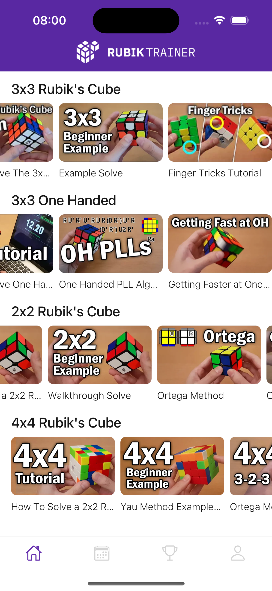
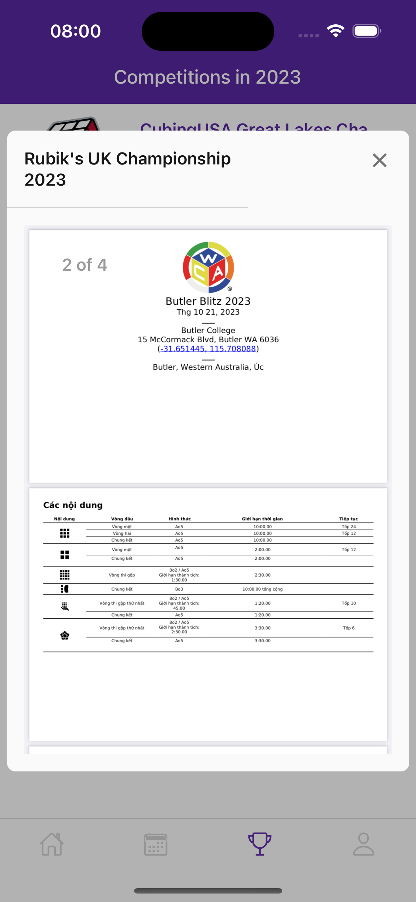

# Rubik Trainer

## Demo App
<a href="https://drive.google.com/file/d/1KF9XVaecfH_Uc3s4RgIV8bv7Z44KnA0P/view">Link Demo<a>


## Table of Contents

-   [Table of Contents](#table-of-contents)
    -   [About](#about)
    -   [Features](#features)
    -   [Screenshots](#screenshots)
    -   [Getting Started](#getting-started)
        -   [Prerequisites](#prerequisites)
        -   [Installation](#installation)

## About
An app that guides users on how to solve different types of Rubik's cubes through videos, displays major Rubik's competitions throughout the year, allows users to schedule events within the app, and shows personal information pages.

## Features

-   Lessons
-   Video
-   Competition

## Screenshots

<p float='left'>




</p>

## Getting Started

### Prerequisites

-   Node.Js: https://nodejs.org/en
-   Expo: https://docs.expo.dev/get-started/installation/
-   Yarn: https://classic.yarnpkg.com/lang/en/docs/install/#mac-stable

### Installation

-   Clone the repository to your local machine
-   Install dependencies using npm or yarn
-   Run the app using `yarn start` or another suitable command

```bash
git clone 
cd 
yarn
yarn start
```
